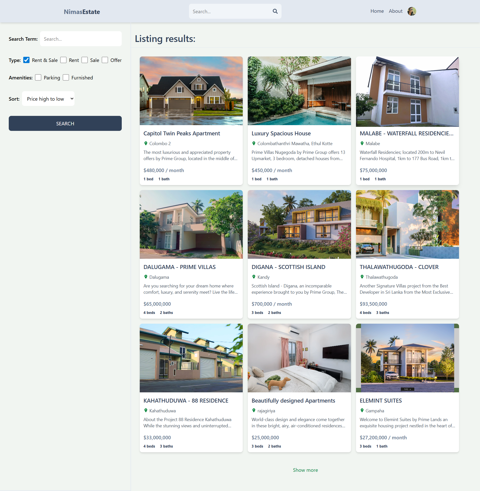
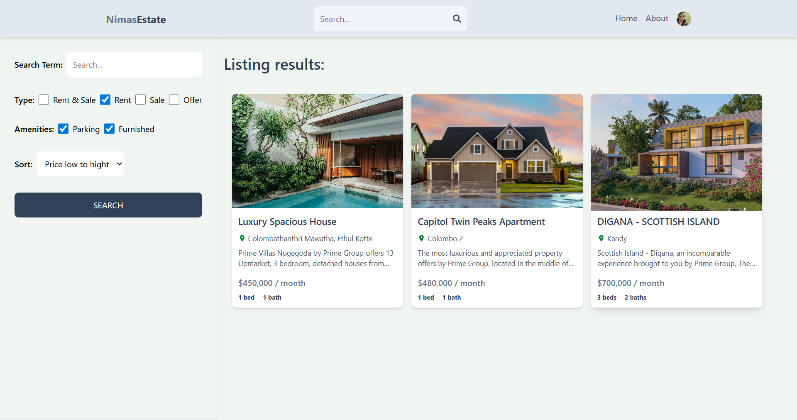
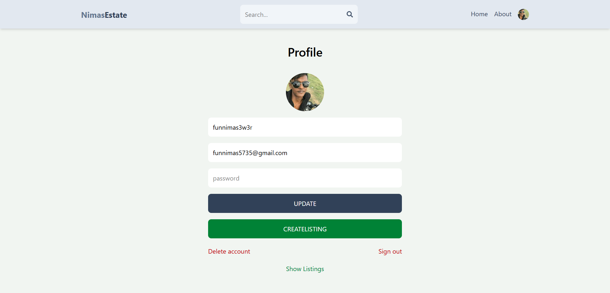
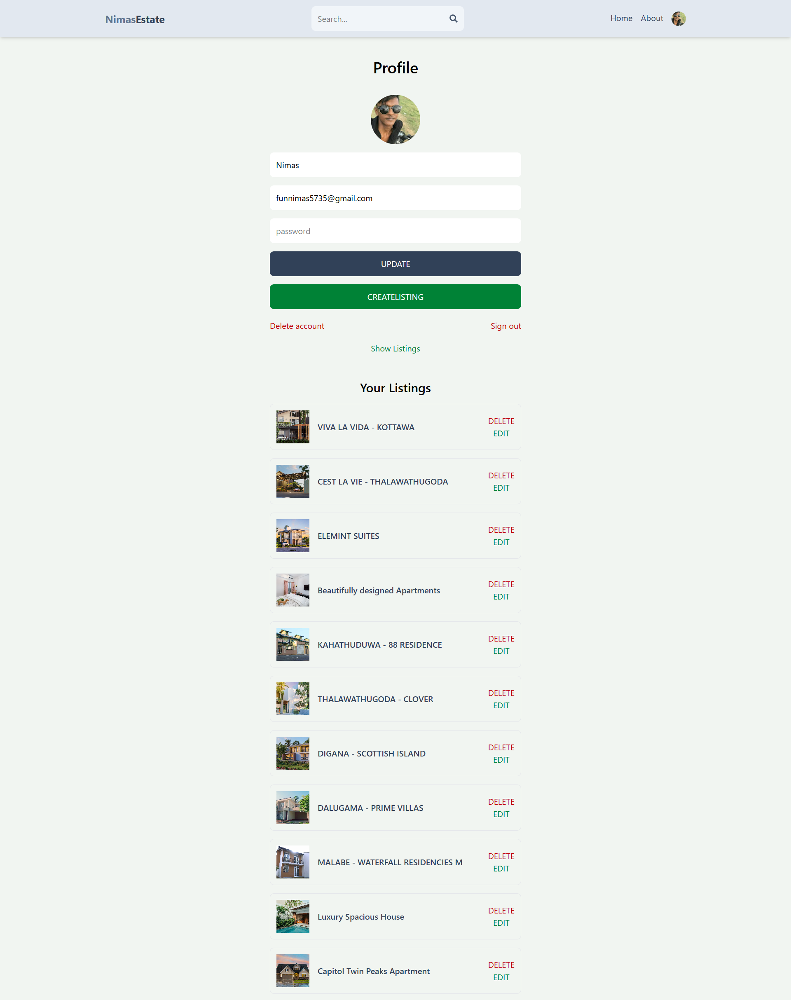

# Nimas Estate 🏡

**Nimas Estate** is a modern, full-stack real estate marketplace application. It provides a seamless platform for users to list properties for sale or rent, browse listings, and contact landlords. Built with the MERN stack, it features robust authentication, image management, and a responsive design.

## 📸 Screenshots










## ✨ Key Features

- **Advanced Authentication:**
  - Secure Email/Password login using **JWT** (JSON Web Tokens).
  - **Google OAuth** integration via **Firebase** for one-click sign-in.
- **Property Management:**
  - Create, Update, and Delete property listings.
  - Categorize properties for **Rent** or **Sale**.
  - Real-time image uploads using **Multer** and **Cloudinary**.
- **Modern UI/UX:**
  - Fully responsive design built with **Tailwind CSS**.
  - Interactive image sliders for property details.
- **State Management:**
  - Global state management using **Redux Toolkit** for user data and listing states.
- **Search & Filter:**
  - Advanced search functionality to filter properties by type, offer, parking, and furnishing.

---

## 🛠️ Tech Stack

### **Frontend**

- **React.js**: Library for building the user interface.
- **Redux Toolkit**: For efficient global state management.
- **Tailwind CSS**: Utility-first CSS framework for styling.
- **Firebase**: For Google Authentication integration.

### **Backend**

- **Node.js**: Runtime environment.
- **Express.js**: Web framework for the API.
- **MongoDB**: NoSQL database for storing user and listing data.
- **Mongoose**: ODM (Object Data Modeling) library for MongoDB.

### **Utilities & Security**

- **Cloudinary**: Cloud storage service for property images.
- **Multer**: Middleware for handling `multipart/form-data`.
- **JWT (JSON Web Tokens)**: For secure user authentication.
- **Bcrypt.js**: For password hashing and security.

---

## 🚀 Getting Started

Follow these steps to set up the project locally.

### Prerequisites

Make sure you have the following installed:

- [Node.js](https://nodejs.org/) (v14 or higher)
- [npm](https://www.npmjs.com/) or [yarn](https://yarnpkg.com/)
- [MongoDB](https://www.mongodb.com/) (Local or Atlas URL)

### Installation

1.  **Clone the repository**

    ```bash
    git clone [https://github.com/Kafoor-Nimas/mern-estate.git](https://github.com/Kafoor-Nimas/mern-estate.git)
    cd mern-estate
    ```

2.  **Install Backend Dependencies**

    ```bash
    # Assuming you are in the root directory
    npm install
    ```

3.  **Install Frontend Dependencies**
    ```bash
    cd client
    npm install
    ```

### Environment Configuration

1. Create a `.env` file in your **root** directory and add the following variables:

   ```env
   MONGO_URI=your_mongodb_connection_string
   JWT_SECRET=your_secret_key
   PORT=3000

   # Cloudinary Configuration
   CLOUDINARY_CLOUD_NAME=your_cloud_name
   CLOUDINARY_API_KEY=your_api_key
   CLOUDINARY_API_SECRET=your_api_secret
   ```

2. Create a `.env` file in your **client** directory for Firebase:

   ```env
   VITE_FIREBASE_API_KEY=your_firebase_api_key
   ```

### Running the App

1. **Start the Backend Server**

   ```bash
   # From the root directory
   npm run start
   # or for development with nodemon
   npm run dev
   ```

2. **Start the Client**

   ```bash
   cd client
   npm run dev
   ```

Visit `http://localhost:5173` (or your configured port) to view the app.

---

## 📞 Contact

**Nimas Kafoor**

- **Email:** [nimaskafoor@gmail.com](mailto:nimaskafoor@gmail.com)
- **GitHub:** [github.com/Kafoor-Nimas](https://github.com/Kafoor-Nimas)
- **LinkedIn:** [linkedin.com/in/nimas-kafoor](https://www.linkedin.com/in/nimas-kafoor)
